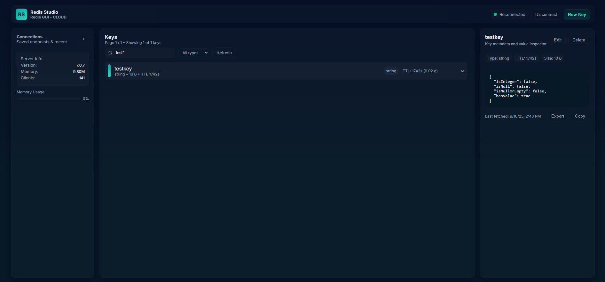

# Redis Studio

A Redis client with a beautiful web interface built with Angular and ASP.NET Core. Real-time key management, and full accessibility support.





## ✨ Features

- **Modern UI**: Clean, responsive interface matching the original design exactly
- **Key Management**: List, create, update, and delete Redis keys with full type support
- **Real-time Operations**: Live key monitoring with TTL display
- **Accessibility**: Full WCAG compliance with keyboard navigation and ARIA labels
- **Docker Ready**: Complete containerization with Podman/Docker Compose

## 🚀 Quick Start

### Prerequisites

- Docker or Podman
- Podman Compose (or Docker Compose)
- Node.js 18+ (for local development)
- .NET 8 SDK (for local development)

### Running with Podman Compose

1. **Clone and start services:**
   ```bash
   cd redis-studio
   podman-compose up --build
   ```

2. **Access the application:**
   - Frontend: http://localhost:4200
   - Backend API: http://localhost:5000
   - Redis: localhost:6379

3. **Connect to Redis:**
   - Use the connection modal to connect to `redis://redis:6379`
   - Or connect to your own Redis instance

### Running with Docker Compose

```bash
# Replace podman-compose with docker-compose
docker-compose up --build
```

## 🏗️ Architecture

The project is a two-tier web application (Angular SPA + ASP.NET Core API) communicating with Redis. It emphasizes fast key browsing, multi-connection support, and production-ready containerization.

### High-Level Flow
1. User opens the Angular SPA (served by Nginx in container or `ng serve`).
2. User supplies a Redis connection string; backend returns a `connectionId`.
3. Subsequent API calls include `X-Connection-Id` header to multiplex multiple logical Redis connections (supports future multi-tab / multi-instance scenarios without per-user server state persistence beyond in-memory connection pool).
4. Key list requests are paginated and stream through Redis keys without loading the entire keyspace into memory.
5. Frontend displays metadata (TTL, derived days to expire, type, size) and lazy-fetches specific key values when selected.

### Repository Structure
```
redis-studio/
├── frontend/                 # Angular 16+ SPA (component-driven)
│   ├── src/
│   │   ├── app/
│   │   │   ├── components/   # Feature + UI components (key-list, key-details, modals, pagination, spinner, top-bar, memory-usage)
│   │   │   ├── services/     # `redis.service.ts` (API client), `theme.service.ts`
│   │   │   ├── abstractions/ # (Planned) central models & constants (`ui.constants.ts` already present)
│   │   │   └── ...
│   │   └── environments/     # Angular environment configs (api base injected at build/runtime)
│   ├── Dockerfile            # Multi-stage build -> Nginx static serve with runtime env substitution
│   └── nginx.conf            # Security headers + SPA routing
├── backend/
│   ├── RedisStudio.Api/      # ASP.NET Core 8 minimal hosting model
│   │   ├── Controllers/      # `RedisController` (connection mgmt, CRUD, pagination, server info, disconnect)
│   │   ├── Services/         # `RedisService` (key ops, streaming pagination, TTL & size calc), `RedisConnectionManager`
│   │   ├── Interfaces/       # Contracts (IRedisService, IRedisConnectionManager)
│   │   ├── Models/           # DTOs: key metadata (ttl, daysToExpire, size, rawString)
│   │   └── Program.cs        # App setup (+ `/health` endpoint, permissive CORS for SPA)
│   ├── Dockerfile            # SDK build stage -> runtime image; `.dockerignore` trims context
│   └── .dockerignore         # Excludes `.vs/`, `bin/`, `obj/` to avoid Windows file locks
├── podman-compose.yml        # Orchestration: redis, backend, frontend w/ healthchecks
└── docs/                     # Screenshots & assets
```

### Backend Design
- **Connection Multiplexing**: Clients obtain a `connectionId` via `POST /api/redis/connection/connect`; in-memory dictionary holds `ConnectionMultiplexer` instances. All subsequent calls must send `X-Connection-Id` header.
- **Streaming Pagination**: `RedisService.GetKeysPageAsync` iterates server keys lazily, only materializing the requested page’s metadata while still counting total for page navigation.
- **Metadata Enrichment**: Each key includes: type, TTL seconds, derived `daysToExpire` (ceil), size (type-specific metric), and last accessed timestamp.
- **Selective Value Fetch**: Full value fetched only when a specific key is requested; list/hash/set values are size-limited to prevent over-fetch.
- **Health Endpoint**: `/health` lightweight probe used by compose healthchecks.

### Frontend Design
- **Componentization**: Separate components for structural (top bar, layout parts) and functional areas (key list, key details, pagination, modals, memory usage, spinner) enabling future lazy-loading.
- **State Handling**: Connection state + `connectionId` persisted in `localStorage` for refresh resilience. Key selection & pagination held in component state; service abstracts API calls.
- **Constants & Accessibility**: UI strings centralized (`ui.constants.ts`); ARIA roles/labels and keyboard interactions implemented for core interactive components.
- **Runtime API Base**: Angular build can have API base replaced at container start (env substitution script in frontend Dockerfile) to support different deployment environments without rebuild.

### Container & Deployment
- **Multi-Stage Builds**: Angular compiled in Node image, served via slim Nginx; .NET built in SDK image then published to runtime image.
- **Healthchecks**: Redis PING, backend `/health`, frontend root fetch to ensure readiness before reporting healthy.
- **Optimized Context**: Backend `.dockerignore` prevents locked `.vs` files causing Podman build failures on Windows.

### Planned / In-Progress Refactors
- Consolidate TypeScript interfaces into `abstractions/models` barrel.
- Introduce layout wrapper components.
- Further extraction of remaining inline styles to component stylesheets.

This architecture balances fast iteration (simple in-memory connection registry) with scalability (header-based connection isolation, streaming key enumeration, containerized delivery).

## 🛠️ Development Setup

### Backend Development

```bash
cd backend/RedisStudio.Api
dotnet restore
dotnet run
```

The API will be available at https://localhost:7074

### Frontend Development

```bash
cd frontend
npm install
npm start
```

The frontend will be available at http://localhost:4200

### Running Redis Locally

```bash
# Using Docker
docker run -d -p 6379:6379 redis:7-alpine

# Using Podman
podman run -d -p 6379:6379 redis:7-alpine
```

## 📚 API Documentation

### Endpoints

| Method | Endpoint | Description |
|--------|----------|-------------|
| GET | `/api/redis/keys` | List all keys with metadata |
| GET | `/api/redis/keys/{key}` | Get specific key value |
| POST | `/api/redis/keys` | Create new key |
| PUT | `/api/redis/keys/{key}` | Update existing key |
| DELETE | `/api/redis/keys/{key}` | Delete key |
| GET | `/api/redis/connection/test` | Test Redis connection |
| GET | `/api/redis/server/info` | Get server information |

### Example Requests

**Create a key:**
```bash
curl -X POST http://localhost:5000/api/redis/keys \
  -H "Content-Type: application/json" \
  -d '{
    "key": "user:1001",
    "value": "John Doe",
    "type": "string",
    "ttlSeconds": 3600
  }'
```

**Get all keys:**
```bash
curl http://localhost:5000/api/redis/keys?pattern=user:*
```

## 🔧 Configuration

### Environment Variables

**Frontend (`environment.ts`):**
```typescript
export const environment = {
  production: false,
  apiUrl: 'http://localhost:5000/api'
};
```

## 🐳 Container Configuration

### Health Checks

All services include health checks:
- **Redis**: `redis-cli ping`
- **Backend**: API connection test endpoint
- **Frontend**: HTTP response check

### Resource Limits

Default resource limits are production-ready. Adjust in `podman-compose.yml`:

```yaml
services:
  backend:
    deploy:
      resources:
        limits:
          memory: 512M
          cpus: '0.5'
```

## 🔒 Security

### Features

- **Input Validation**: All API inputs validated
- **Error Handling**: Secure error messages
- **Security Headers**: Nginx security headers configured

### Best Practices

1. **Use TLS in production**
2. **Configure Redis AUTH**
3. **Set up reverse proxy**
4. **Regular security updates**

## 📊 Monitoring

### Application Metrics

Monitor via:
- Health check endpoints
- Container logs: `podman-compose logs -f`
- Redis INFO command

### Performance

Optimizations included:
- Nginx gzip compression
- Static asset caching
- Angular production build
- Redis connection pooling

## 🚀 Deployment

### Production Deployment

**Build for production:**
   ```bash
   podman-compose -f podman-compose.yml -f podman-compose.prod.yml up --build
   ```

## 📝 License

This project is licensed under the MIT License - see the [LICENSE](LICENSE) file for details.
